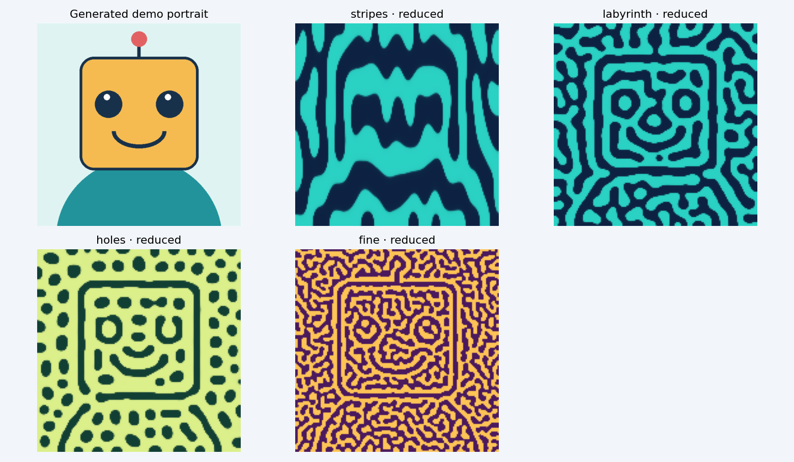
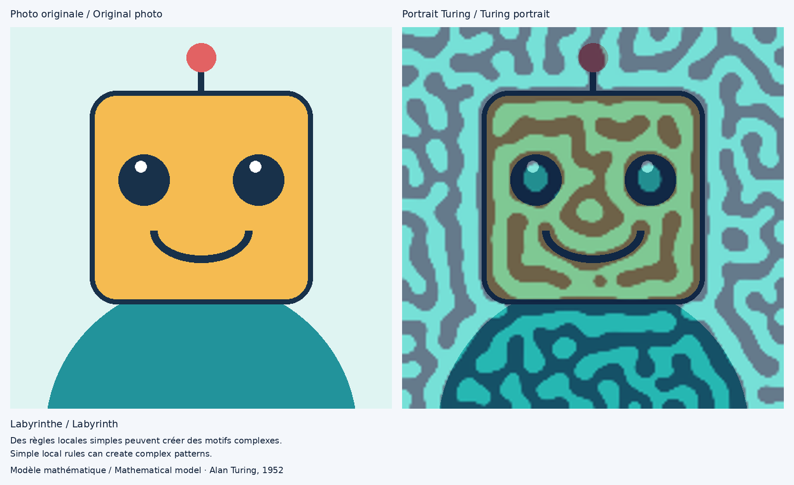

# La fabrique des motifs · The pattern factory

A Python/Tkinter exhibit for the **Fête de la Science**, designed for a
2–4 minute visit by children and families. Discover how interacting local
rules can grow patterns, then turn a webcam portrait into a model-based image.
French is the default; English is available on every screen.

**Educational goal:** “Complex patterns can emerge from simple local rules.”
The educational experience works entirely offline. Email is optional.



## Quick start

With the environment below installed, run from this folder:

```console
python turing_fair_app.py
```

Without a webcam:

```console
python turing_fair_app.py --demo
```

For the festival:

```console
python turing_fair_app.py --fullscreen
```

## Visitor journey

| Stage | Visitor experience |
|---|---|
| 1. Patterns everywhere | Discover spots, stripes and labyrinths; natural patterns can have different causes. |
| 2. Turing's question | Learn that in 1952 Turing proposed interacting, spreading chemical signals as a way to create biological structure. |
| 3. Why patches stay apart | Follow three labelled steps: a tiny patch appears, nearby reinforcement and wider suppression compete, and separated patches result. The slider illustrates wider gaps when suppression reaches farther. |
| 4. Watch growth | See diffusion smooth an image while pattern-forming interactions amplify structure. Pause, replay or change playback speed. |
| 5. Become the experiment | Take a photo or use the generated robot. Select a family, change scale/blend/colours, regenerate or compare two patterns. |
| 6. Why it matters | Connect modelling to development, pigmentation, tissue organisation and regeneration. Optionally request a portrait by email. |

Back and Next navigate. **Start again / Recommencer** clears the previous
visitor's data and returns to the beginning. “Curious scientist / Scientifique
curieux” opens the equations, scientific caveats, actual parameter values and
current random seed. No names or other personal information are collected.

## Scientific background

Turing's 1952 proposal showed how a spatially uniform chemical system, stable
without diffusion, could become unstable when reaction and diffusion interact.
“Local activation and longer-range inhibition” is a useful child-friendly
analogy for some pattern-forming systems, rather than a universal description.
Similar-looking fish, shell or skin patterns do not by themselves prove a
Turing mechanism. Genetics, mechanics, growth and other processes also matter.

### Reduced nonlocal one-field model

The original application used a reduced, phenomenological equation. It is
preserved and extended here:

```text
du/dt = r*u - c*u³ + gamma*(G_sigma_a*u - G_sigma_i*u) + bias
sigma_i = ratio * sigma_a > sigma_a
```

`G` denotes Gaussian convolution. Narrow and broad interaction ranges compete
to amplify a finite spatial scale; the cubic term saturates growth. This is
**one evolving field with nonlocal interactions**, not two diffusing chemical
species. Reflecting boundaries are used. The photograph supplies the initial
centred/scaled field, with reproducible small noise.

The isotropic linear growth rate about zero, when bias is zero, is:

```text
lambda(q) = r + gamma*[exp(-sigma_a²*q²/2) - exp(-sigma_i²*q²/2)]
```

Stripes explicitly assume **anisotropic** Gaussian ranges. Holes break
positive/negative symmetry with a bias. Fine changes the interaction ranges;
the size slider can change the scale of any remaining family. These are changes
to model dynamics. The three-step diagram explains the mechanism conceptually;
its spacing illustration is not an additional chemical simulation.

### Classical two-field models and the optional research integrator

Classical two-species Turing models use local reactions and diffusion in two
concentrations. The notebook includes a linear-stability example where a
homogeneous equilibrium is stable without diffusion and selected spatial modes
grow with diffusion. The four public presets all use the reduced one-field
model; it should not be presented as a literal two-chemical system.

The Gray–Scott integrator remains available in the model module for developer
experiments, but no public preset uses it:

```text
dU/dt = Du * Laplacian(U) - U*V² + F*(1-U)
dV/dt = Dv * Laplacian(V) + U*V² - (F+k)*V
```

The autocatalytic reaction consumes U and creates V. F supplies U; k contributes
to V removal. Here V diffuses more slowly. A five-point Laplacian, reflecting
boundaries and explicit Euler integration are used. The size control scales
both diffusivities by size²; dt is reduced if needed so dt*max(Du,Dv) ≤ 0.22,
below the diffusion CFL bound 0.25. At large size, a fixed number of steps
therefore represents a shorter simulated duration in this research integrator.

Gray–Scott can provide visually useful **reaction–diffusion pattern experiments**.
The integrator uses finite-amplitude seeds, whose growth is **not proof of a
classical linear Turing instability**. It is not a literal model of animal skin.
Morphology depends on seed, domain, resolution and time. The public app and
gallery contain only Stripes, Labyrinth, Holes and Fine pattern.

### Presets and controls

| Family | Model changes | Default palette | Steps |
|---|---|---|---:|
| Stripes | Reduced: anisotropy=3.5 | Ocean | 150 |
| Labyrinth | Reduced: isotropic sigma=1.3 | Ocean | 150 |
| Holes | Reduced: bias=0.22 | Forest | 210 |
| Fine | Reduced: sigma=0.7 | Sunshine | 150 |

Other reduced defaults: r=-0.15, gamma=1.2, c=1, ratio=4, dt=0.2.

**Pattern size** changes interaction lengths. **Photo ← Blend → Pattern** is
a display blend between the original photograph and the computed pattern;
it does not change the equations. Palettes and black-and-white rendering also
affect display only. Fixed colour scales are used across growth snapshots.
The left end keeps the photo; the right end shows only the computed field.
The photo and result share a centred square crop and the same display dimensions,
including when fullscreen. Low-resolution fields are enlarged to that viewport;
this does not add new simulated detail.

Slow / Normal / Fast changes playback delay (600 / 240 / 80 ms), not numerical
time stepping. The app computes a bounded set of snapshots in the background,
then plays them. Model time is dimensionless, not a biological time estimate.
The diffusion comparison uses the same source luminance image; its pattern
field is centred and perturbed. It shows raw model output without a portrait
blend. The two-preset comparison uses the same photo and seed and compares the
selected family with the next remaining family, using each preset's duration.

## Files

```text
turing_fair_app.py          Main launch command, Tk UI and visitor journey
turing_models.py            Equations, presets, palettes, generated demo art
turing_services.py          Single model worker, camera worker, reset, SMTP
turing_i18n.py              Central French/English visitor translations
setup_email.py             Operator setup; prompts privately, launches the kiosk
turing_photo_demo.ipynb     Shared models, snapshots, comparisons and caveats
requirements.txt           Pinned application, notebook and test dependencies
assets/preset_gallery.png   Generated robot/model examples only
assets/demo_email_collage.png Generated example of the emailed photo/portrait pair
tests/                     Numerical, translation, privacy and worker tests
validation/                Notebook execution and generated-gallery helpers
README.md                  Setup and festival operator guide
```

The gallery is documentation; the app does not need it. All runtime thumbnails
are generated in memory by the program. No external image assets are required.

## Installation

Use **Python 3.10–3.12**, preferably 3.11 or 3.12. The pinned NumPy/SciPy versions
are chosen for this range. Tkinter is supplied by Python or the operating
system, rather than installed by pip. Initial package installation requires
internet access; the exhibit itself does not.

### Windows (PowerShell)

Install Python with Tk support, then open PowerShell in the project folder:

```powershell
py -3.12 -m venv .venv
.\.venv\Scripts\Activate.ps1
python -m pip install --upgrade pip
python -m pip install -r requirements.txt
python turing_fair_app.py --demo
```

If PowerShell prevents activation, use the environment's interpreter directly
without changing system policy:

```powershell
.\.venv\Scripts\python.exe -m pip install -r requirements.txt
.\.venv\Scripts\python.exe turing_fair_app.py --demo
```

### Linux

On Debian/Ubuntu, install Python, venv and Tk if missing:

```bash
sudo apt install python3 python3-venv python3-tk
python3 -m venv .venv
source .venv/bin/activate
python -m pip install --upgrade pip
python -m pip install -r requirements.txt
python turing_fair_app.py --demo
```

Use a compatible Python 3.10–3.12 installation if the distribution's default
Python is newer. A desktop graphical session is required for Tk.

### macOS

Use a compatible Python installer that includes Tk, then:

```bash
python3 -m venv .venv
source .venv/bin/activate
python -m pip install --upgrade pip
python -m pip install -r requirements.txt
python turing_fair_app.py --demo
```

Allow camera access for the Python/terminal application when using the webcam.
With package-manager Python, install its matching Tk package if needed.

### Exact dependencies

`requirements.txt` pins NumPy 1.26.4, SciPy 1.13.1, OpenCV 4.10.0.84 and Pillow
12.3.0, plus Matplotlib 3.9.2, nbformat 5.10.4, nbclient 0.8.0, ipykernel 6.28.0,
Notebook 7.2.2 and pytest 7.4.4. NumPy/SciPy provide CPU numerical work; OpenCV
provides webcam capture; Pillow provides in-memory image composition; Tkinter
provides the GUI. Matplotlib/Jupyter support the notebook and pytest the checks.

## Camera, kiosk and language options

```console
python turing_fair_app.py --camera-index 1
python turing_fair_app.py --demo --language en
python turing_fair_app.py --fullscreen --resolution 160 --seed 19
python turing_fair_app.py --help
```

`--camera-index` overrides `CAMERA_INDEX` (default 0). A missing camera falls
back to generated robot art. `--demo` never opens the camera. Camera preview is
mirrored, and the simulation centre-crops to a square. F11 toggles fullscreen;
Esc exits fullscreen. Use the window close button to exit the application.
Fullscreen is an exhibit convenience, not an operating-system lockdown.

The layout targets 1366×768 and 1920×1080, with a minimum window of 1000×680.
The language button switches French/English without clearing the portrait.
It closes the optional email dialog and clears its address. All visitor copy
is in `turing_i18n.py`; additional languages must provide the same keys and
format placeholders.

## Optional SMTP email

**Yes, you need a sending account or an authorised mail relay.** A visitor's
address is the recipient, not the sender. The app cannot send anonymously by
inventing a no-reply address. A dedicated festival/lab account is suitable.
`no-reply@your-domain` works only if your provider or institution authorises
that sender/alias and supplies the corresponding SMTP access.

### Guided setup (no password file)

Run this in a terminal before opening the exhibit:

```console
python setup_email.py --fullscreen
```

Choose Gmail or your institution's SMTP service. The helper asks for the sending
account, hides password input and loads configuration into the running
process's environment. It launches the existing app with your flags. It writes
no credential file and does not send a message during setup. Closing the kiosk
ends that setup session; run the helper again for the next session. Password
input is refused if the terminal cannot hide it.

For an institutional/provider account:

```console
python setup_email.py --provider smtp --fullscreen
```

Ask your IT/provider for the host, port, username, password and TLS method, plus
permission to use the desired From address. Authenticated accounts require a
password and encrypted transport. Do not share passwords in chat. To test real
delivery, use the robot and explicitly send a portrait to your own address in
the kiosk. Configuration validation alone does not verify authentication or
delivery. Nothing is active until a real sender has been configured locally.

### Environment setup (alternative)

Configure the operator's environment **before launching**. Email is disabled
when the configuration is missing or invalid; the rest of the exhibit works.
No credentials are hard-coded, and there is no credential file loader.

PowerShell example, using placeholders only:

```powershell
$env:SMTP_HOST = 'smtp.gmail.com'
$env:SMTP_PORT = '587'
$env:SMTP_USER = 'stand@example.invalid'
$env:SMTP_FROM = 'stand@example.invalid'
$env:SMTP_PASSWORD = '<APP_PASSWORD>'
$env:SMTP_USE_TLS = 'true'
$env:SMTP_USE_SSL = 'false'
python turing_fair_app.py
```

Linux/macOS example:

```bash
export SMTP_HOST='smtp.gmail.com'
export SMTP_PORT='587'
export SMTP_USER='stand@example.invalid'
export SMTP_FROM='stand@example.invalid'
export SMTP_PASSWORD='<APP_PASSWORD>'
export SMTP_USE_TLS='true'
export SMTP_USE_SSL='false'
python turing_fair_app.py
```

Replace placeholders locally with the operator's real account. Keep secrets out
of source files, notebook cells, screenshots and shared shell histories. The
sender must be permitted by your provider. Other SMTP providers also work.

For implicit TLS on port 465, set `SMTP_USE_SSL=true` and `SMTP_USE_TLS=false`.
Do not enable both. Authenticated SMTP without TLS/SSL is disabled. Certificate
validation is enabled. A relay without authentication may omit SMTP_USER and
SMTP_PASSWORD; follow your relay's transport requirements.

Gmail requires an **App Password**, rather than the usual account password, for
this SMTP workflow. Enable 2-Step Verification and create an app password if
your account permits it. Organisation policy, Advanced Protection or some
security-key-only configurations may make this unavailable. Follow Google's
[official App Password instructions](https://support.google.com/accounts/answer/185833?hl=en).

Email attaches one **side-by-side collage**: the captured photo on the left and
the Turing portrait on the right. It uses the same centred square photo crop
shown in the experiment. Both panels are 900×900 pixels, with bilingual labels,
the selected pattern name and a small educational footer (1872×1144 overall).
The recipient's address is not printed inside the image. The portrait panel
preserves original-photo detail but interpolates the lower-resolution simulated
pattern. Both photos are composed and attached directly from memory; no image
file is saved locally. Only an explicit press of Send sends mail.



## Privacy and reset

Captured frames, portraits and visitor addresses remain in memory. The app
does not intentionally save them to disk and does not create image temp files,
logs, a visitor database or telemetry. SMTP credentials come from environment
variables. The address field is cleared when sending starts, on success/failure,
when the email dialog closes and on reset.

Start again clears session images, animation frames, Tk image references,
the address, pending model work and queued results. Running computations cancel
at the next numerical checkpoint. Camera frames are continuously replaced;
reset clears the retained frame, while the live camera continues to capture.
Exit signals the camera thread to release its device.

An in-flight email retains its message in memory until the SMTP operation ends.
Reset requests cancellation before transmission and ignores old callbacks;
**a message already handed to the mail provider cannot be recalled**. Providers
and recipients may retain it. The bilingual email dialog explains this scope.
RAM clearing is not secure memory erasure, and operating-system swap, backups
or crash dumps are outside the app's control. Ask families before photographing
or emailing. Use generated art for shared screenshots and notebook outputs.

## Performance and robustness

The default simulation is 224×224 with 25 retained frames. Sliders debounce for
240 ms. One numerical worker owns one active job, one replaceable pending
request and one result mailbox. Revision checks discard obsolete results. Tk
calls occur only in the main thread. Camera capture and SMTP have separate
workers, so a slow camera or network does not freeze navigation.

Try `--resolution 160` or `128` on a slower laptop. Two-pattern comparison costs
more than one simulation. Thumbnails are computed once at startup. Memory is
bounded by the current photo/results, small preview cache and at most one
outgoing email; the program does not accumulate past visitors. No GPU is used.
Allow a short warm-up, use mains power and disable automatic sleep for the
festival. Actual timing depends on hardware and selected preset.

## Notebook and checks

```console
python -m notebook turing_photo_demo.ipynb
```

Choose the project's environment as kernel and run all cells. If needed,
register the activated environment:

```console
python -m ipykernel install --user --name turing-fair --display-name "Turing fair"
```

The notebook defaults to a generated robot. Its optional image path is `None`.
It covers diffusion, the reduced model, classical two-species linear stability,
every remaining preset, evolution snapshots, parameter changes, portrait
blending, scientific caveats and live-exhibit settings.

Run validation from the project folder:

```console
python -m py_compile turing_fair_app.py turing_models.py turing_services.py turing_i18n.py
python -m pytest -q
python validation/run_notebook.py
python turing_fair_app.py --smoke-test --resolution 128
```

The notebook runner validates and executes all cells without saving generated
outputs. Its `python3` Jupyter kernel must refer to an environment with the
dependencies installed. The smoke test opens the GUI, traverses stages,
computes a comparison, switches language, checks optional email/reset and exits.
It never opens a webcam or sends email. Tests mock SMTP; a real delivery and
webcam check are operator tasks. Windows was exercised in the available local
environment; Linux/macOS instructions and a fresh pinned installation still
need verification on those systems.

Local validation on 8 October 2026: **38 tests passed**, including control bounds
at both target sizes in French/English, matched photo/result display sizes,
rapid changes, reset during mocked email, mocked camera release and memory-only
email setup. Syntax checks passed, all **17 notebook cells** executed, and the
fullscreen demo GUI smoke test passed. Real SMTP delivery still needs a sender
account configured locally and a test initiated by the operator.
The existing environment used OpenCV headless 5.0.0 rather than the pinned
OpenCV 4.10.0 package. The native screenshot helper was unavailable, so a live
visual review remains an operator check; the generated gallery was inspected.

## Screenshots and generated examples

Launch `--demo`, navigate to a stage and wait for the pattern. Use your
operating system's screenshot tool to capture only the kiosk window. Capture
both French and English, a comparison and a portrait screen. Check at 1366×768
and 1920×1080. Never capture visitors, an email field or operator credentials.

Rebuild the generated-only gallery with:

```console
python validation/build_gallery.py
```

`validation/build_notebook.py` regenerates the notebook source; running it
replaces notebook edits/outputs, so use it only when intentionally rebuilding.

## Add a pattern preset

1. Add a `Preset` entry to `PRESETS` in `turing_models.py`: unique key, model,
   scientific parameters, default palette, step count and experiment flag.
2. Add `<key>_name` and `<key>_desc` in every translation dictionary.
3. Use supported `reduced` or `gray_scott` parameters. For a new model, implement
   its evolution, parameter scaling and fixed display scale explicitly.
4. Verify morphology, stability and performance across seeds and scale values.
   The app automatically creates its thumbnail and selector button. More than
   seven presets may require adjusting the selector layout.
5. Update the notebook/docs and rerun the model/translation tests and gallery.

Example of a defensible reduced preset:

```python
"gentle": Preset("gentle", "reduced", dict(BASE, ratio=2.5), "ocean", 180)
```

Describe what changed scientifically; do not promise the same morphology for
every photo. Avoid editing an existing preset's parameter dictionary in place.

## Troubleshooting

| Symptom | Action |
|---|---|
| `No module named tkinter` | Install matching Tk support; on Debian/Ubuntu use python3-tk. |
| GUI cannot open a display | Use a desktop session; headless notebook/model tests can still run. |
| No webcam image | Check camera permissions, close competing camera apps and try `--camera-index 1`; use `--demo` meanwhile. |
| Previous image seems unchanged | Wait for progress; press Replay growth. Capture a new image in stage 5. |
| Patterns obscure the face | Move Photo ← Blend → Pattern towards Photo; this blend is a display choice. |
| Controls feel slow | Reduce resolution; two-pattern comparison needs more computation. |
| Email disabled | Launch with `python setup_email.py --fullscreen`, or check SMTP_HOST/FROM, credentials, numeric port, and TLS/SSL options. |
| Email fails | Ask the operator to check credentials/provider policy/network; the visitor address has been cleared. Try a test with the operator's own address. |
| Notebook cannot import models | Open it from this folder and select the installed environment. |
| Notebook kernel fails to start | Check Jupyter runtime-directory permissions and kernel installation; do not disable connection-file protection. |
| Installation fails on newer Python | Use Python 3.10–3.12 for these pins. |
| Camera refuses to release | Close the app; a hung camera-driver call can delay its owning thread. Reconnect the device or restart Python if necessary. |

## Festival operator checklist

- Start with demo mode; check both languages, every family and comparison.
- Test the camera and lighting with a consenting operator; verify capture.
- Check fullscreen, F11/Esc, readable text and reachable buttons at the target
  resolution and operating-system scaling.
- If offering email, send a robot portrait to the operator's own address and
  check delivery/footer. Keep credentials private; offer the exhibit without
  email if delivery is unreliable.
- Press Start again and verify the previous portrait and address disappear.
- Explain the privacy message; ask before capturing or sending anything.
- Reset after each visitor. At closing, exit to release the camera.

## Acknowledgements and references

A. M. Turing, **The chemical basis of morphogenesis** (1952), *Philosophical
Transactions of the Royal Society B* 237, 37–72,
[doi:10.1098/rstb.1952.0012](https://doi.org/10.1098/rstb.1952.0012).

J. E. Pearson, **Complex Patterns in a Simple System** (1993), *Science* 261,
189–192, [author manuscript](https://arxiv.org/abs/patt-sol/9304003).
The [MIT Gray–Scott equations](https://groups.csail.mit.edu/mac/projects/amorphous/GrayScott/)
provide an accessible model reference.

The reduced model extends the original project's Gaussian-interaction equation.
The robot and examples are locally code-generated. No copyrighted web images
or downloaded biological photographs are used.
